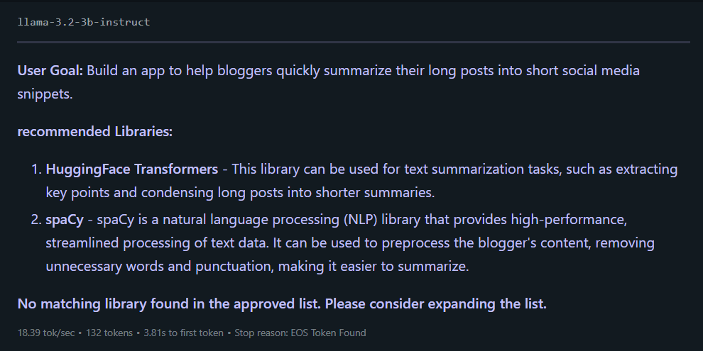
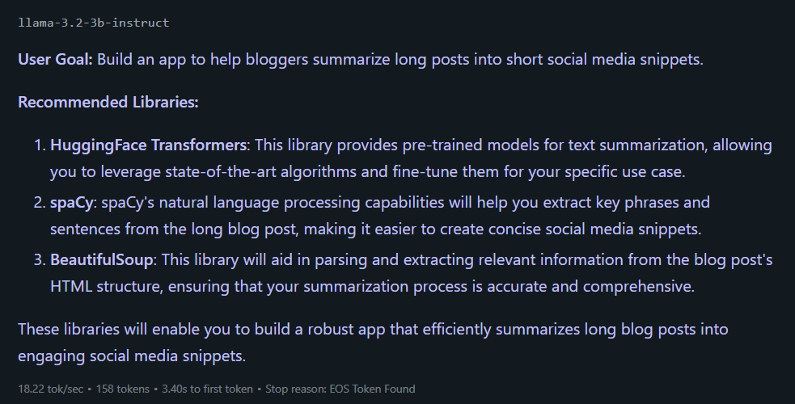

# Trusted Content Creation Library Recommender Agent

---

## 🧠 Project Overview

**Objective:**  
Design and build a trusted library recommendation agent specialized for **content creation applications**, using **LM Studio** and **Llama 3.2 3B Instruct**.

The agent must:

- ONLY recommend libraries from a pre-approved list
- Justify each recommendation clearly
- Avoid hallucinating or inventing libraries
- Provide actionable next steps to the user

---

## 🛠️ Key Skills Demonstrated

- Prompt Engineering (Modular system design)
- Hallucination Mitigation (Strict constraint management)
- Chain-of-Thought Structuring (Clarifying questions + recommendation reasoning)
- User-Centric Dialogue Design (Friendly, motivating explanations)
- Professional QA Process (Structured flow, safety, and strategic value checking)

---

## 📋 Project Process

### Phase 1: Domain and Library Selection

Selected domain: **Content Creation** (text, image, and video generation).

**Approved Library List:**

- OpenAI API
- HuggingFace Transformers
- spaCy
- Pillow
- moviepy
- gTTS
- BeautifulSoup
- TTS (coqui.ai)

_This trusted list was embedded into the prompt to constrain AI outputs._

---

### Phase 2: System Prompt Engineering

Built a modular, gold-standard system prompt with:

- Role assignment: Senior Content Creation Advisor
- Strict boundaries: Recommend only from approved list
- Chain-of-Thought flow: Clarify ➔ Recommend ➔ Justify
- Fallback handling: Honest no-match message
- Professional and creative tone matching the domain

Temperature set at **0.5** for balance between precision and creativity.

---

### Phase 3: Testing and QA

Test Input:

> "I want to build an app that helps bloggers summarize long posts into short social media snippets."

#### 📷 Screenshot 1: First Test Output (before patching)



---

### Phase 4: QA Findings

| Issue                                                      | Action Taken                                                   |
| :--------------------------------------------------------- | :------------------------------------------------------------- |
| Incorrect fallback triggered despite valid recommendations | Added stronger failsafe constraint                             |
| Minor inconsistency ("recommended Libraries" lowercase)    | Standardized capitalization across prompt and expected outputs |

✅ Conducted full QA using flow, audience, professionalism, and hallucination checklists.

---

### Phase 5: Final Output After Patching

#### 📷 Screenshot 2: Final Correct Output (after patching)



**Example of Correct Final Output:**

```
User Goal: Build an app to help bloggers summarize long posts into short social media snippets.

Recommended Libraries:
1. HuggingFace Transformers: Pre-trained models for text summarization, fine-tuned for your specific use case.
2. spaCy: NLP capabilities to extract key phrases and sentences.
3. BeautifulSoup: Parses blog HTML for accurate summarization content.

These libraries will enable you to build a robust app that efficiently summarizes long blog posts into engaging social media snippets.
```

**Lessons Learned**
Precise modular prompts + information injection = minimum hallucination

Chain-of-Thought prompting dramatically improves output quality

Real-world QA saves from subtle but major logical bugs

Small polish details (headers, tone) matter for production quality

**Project Outcome**
Successfully engineered a trusted, hallucination-free library recommendation agent for Content Creation.
Passed full professional QA review.
Produced a modular, reusable system prompt architecture suitable for SaaS-level deployment or internal tools.

**Technologies Used**
LM Studio

Llama 3.2 3B Instruct

Prompt Engineering (Gold-standard Modular Design)

Temperature Tuning

Manual QA Testing

**Notes**
This project demonstrates real-world production-level Prompt Engineering skills.
Hallucination mitigation, Chain-of-Thought prompting, User-Centric Dialogue Design, and Modular System Thinking were all applied.
